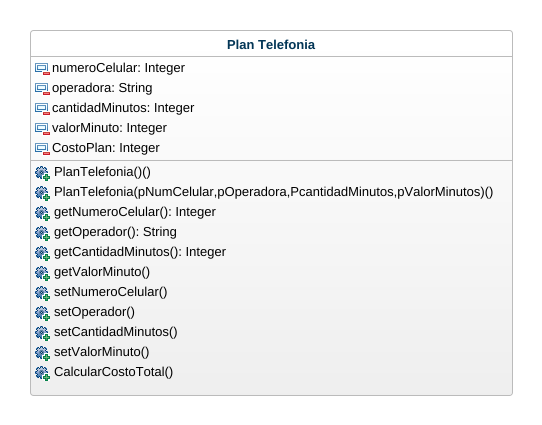
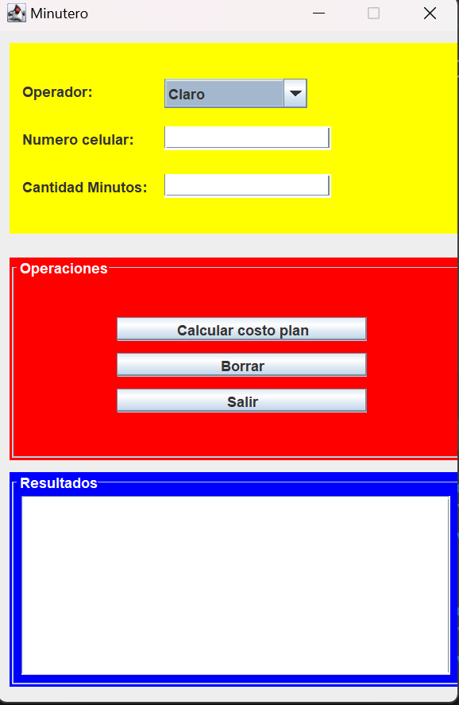
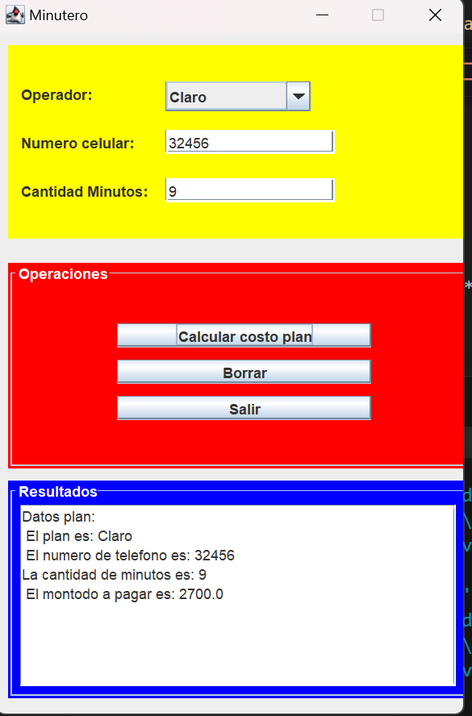
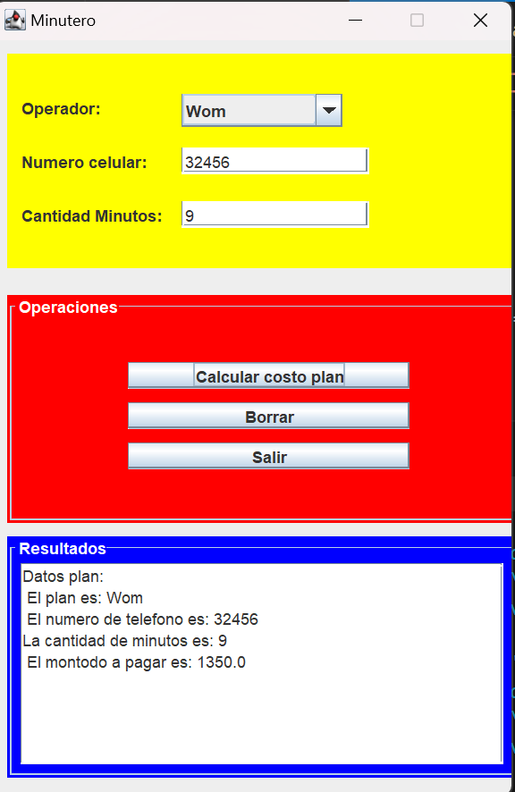

# Telefonia_Movil
Realice el análisis (identificacion de clases, atributos y metodos), el diseño(diagrama de clases) y construccion(patron mvc) de la siguiente situcaión
Se desea gestionar un plan de telefonía movil. El plan tiene un numero de celular, un operador, una cantidad de minutos y un costo por minuto.
Calcular el total a pagar teniendo en cuenta que si el operador es wom tiene un 50% de descuento. 
Usar mínimo dos metodos constructores.
## Diagrama de Clases

## INTERFAZ

## Precio con Claro

## Precio con Wom
